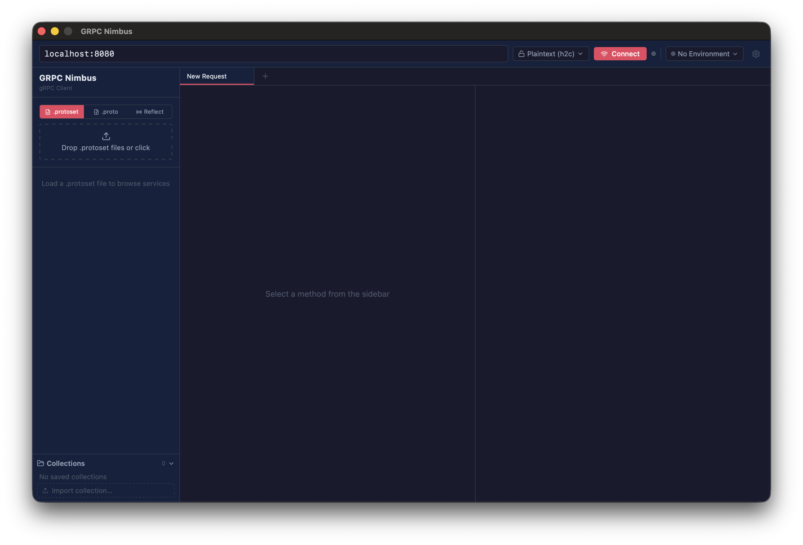

# GRPC Nimbus

> ⚠️ **This repository is not currently accepting pull requests.** Feel free to open an issue for bug reports or feature suggestions.

A cross-platform desktop gRPC client with first-class support for **protoset files**, built on [Wails v2](https://wails.io) (Go + React). Ships as a single native binary for macOS, Windows, and Linux.

<p align="center">
  
</p>

---

## Install

**macOS (Homebrew)**

```bash
brew install --cask CosmicMunkey/tap/grpc-nimbus
```

**Direct downloads**

Visit the [Releases page](https://github.com/CosmicMunkey/grpc-nimbus/releases/latest) to download the latest version for your platform:

| Platform | File |
|----------|------|
| macOS (Apple Silicon) | `grpc-nimbus-vYYYY.WW.N-darwin-arm64.zip` |
| macOS (Intel) | `grpc-nimbus-vYYYY.WW.N-darwin-x86_64.zip` |
| Windows (x64) | `grpc-nimbus-vYYYY.WW.N-windows-amd64.zip` |
| Linux (x64) | `grpc-nimbus-vYYYY.WW.N-linux-amd64.tar.gz` |

---

## macOS: allowing the app to run

macOS Gatekeeper will block GRPC Nimbus from launching because the app is not notarized with an Apple Developer certificate. You'll see a message like *"GRPC Nimbus.app cannot be opened because the developer cannot be verified."*

To clear the quarantine flag, run this once in Terminal after installing the app:

```bash
xattr -dr com.apple.quarantine "/Applications/GRPC Nimbus.app"
```

Then double-click the app as normal. You only need to do this once per installation.

> **Why does this happen?** Apple's Gatekeeper quarantines any app downloaded from the internet that isn't signed and notarized through Apple's paid Developer Program. This is a distribution-time restriction, not a security flaw in the app itself. The command above removes that quarantine attribute.

---

## Why GRPC Nimbus?

Many teams use build pipelines that emit **compiled `.protoset` files** — binary FileDescriptorSet bundles that encode the full schema without requiring all imported `.proto` sources to be present. GRPC Nimbus makes these first-class citizens alongside raw proto files and server reflection.

## Features at a glance

- **Protoset files** — load compiled `.protoset` FileDescriptorSet bundles; no import paths needed
- **Proto source files** — load raw `.proto` files with automatic import path detection
- **Server reflection** — load the full service tree from a live server, with a cancel button if it takes too long
- **Type-aware form builder** — strings, numbers, booleans, enums, nested messages, repeated fields, maps, and oneof groups
- **JSON editor** — switch between the form and a raw JSON body at any time; both stay in sync
- **Multi-tab interface** — open multiple methods simultaneously, rename tabs with a double-click
- **Saved collections** — save requests by name, organized into collections that persist across restarts
- **Portable export** — exported collections embed all referenced protoset files as base64 so the `.json` bundle works on any machine with no extra files
- **Request history** — expandable per-method history showing the full request, response body, status, headers, and trailers
- **Environments** — define named environments with default gRPC metadata headers and an optional host:port override; switch from the connection bar or manage them in the Settings panel; header values support `${ENV_VAR}` and `$(shell command)` dynamic syntax
- **Streaming** — unary, server-streaming, client-streaming, and bidirectional; live event log with stop button
- **Resizable layout** — drag to resize the sidebar and request/response panel split; sizes persist across restarts
- **Stale connection detection** — editing the host or TLS mode while connected surfaces a Reconnect button
- **grpcurl tab** — generates the equivalent grpcurl command for any request
- **Themes** — built-in themes, colorblind-friendly presets, and fully custom named themes you can create and save
- **Settings panel** — organized into Appearance, Themes, Behavior, Requests, and Environments tabs; all preferences persisted
- **Cross-platform** — native desktop binary for macOS (arm64 + amd64), Windows, and Linux

---

## Features

### Proto loading
- **`.protoset` files** — load one or more compiled FileDescriptorSet files; no import paths needed
- **`.proto` source files** — supply import paths and source files directly
- **Server reflection** — connect to a live server that exposes gRPC reflection

### Form builder
Selecting a method populates a **type-aware form** modelled on grpcui:
- String / bytes text inputs
- Numeric inputs (int32/64, uint32/64, float, double) with free-form editing
- Boolean toggles
- Enum drop-downs
- Nested message expansion with +Set / −Remove controls
- Repeated fields with indexed list and Add / Remove buttons
- Map fields with key → value pairs
- Oneof groups with a selector to switch between options

Switch between **Form**, **JSON**, and **Metadata** tabs at any time — the two editors stay in sync.

### Tabs
- Each open request lives in its own tab; open as many as needed
- Tabs can be renamed by double-clicking the tab label
- Closing the last tab opens a fresh blank tab

### Collections & history
- Save any request to a named collection (create new or add to existing)
- Collections persist across restarts; load a saved request in one click
- **Portable export** — exporting a collection embeds all referenced protoset files as base64 so the `.json` bundle can be shared with a colleague and imported on any machine, no separate file transfer needed
- Per-session request history ring-buffer — click any entry to expand and see the full request, response body, status, headers, and trailers

### Environments
- Define named environments with default **gRPC metadata headers** and an optional host:port + TLS override
- Headers are entered as separate key and value fields; values support dynamic syntax (see below)
- Per-request metadata is appended after environment headers, so request-specific values can override them
- Switch environments from the connection bar; the active environment is highlighted in green
- Create and edit environments in the **Settings → Environments** tab with an inline editor — no popover required

**Dynamic header values**

Header values anywhere (environment headers, Settings default metadata, per-request metadata) support dynamic syntax resolved at send time:

| Syntax | Resolves to |
|--------|-------------|
| `${MY_VAR}` | Value of the `MY_VAR` OS environment variable |
| `$(command arg)` | `stdout` of the command, run via `sh -c` (or `cmd /c` on Windows), trimmed (**requires** enabling "Allow shell commands in metadata" in Settings → Requests) |

Examples:
```
Authorization   →   ${API_TOKEN}
Authorization   →   Bearer ${API_TOKEN}
x-timestamp     →   $(date +%s)
x-aws-identity  →   $(aws sts get-caller-identity --query UserId --output text)
```

Inputs that contain either syntax show a small `$` badge. Shell command interpolation is disabled by default.

### Settings

Open the Settings panel with the gear icon in the connection bar. Settings are organized into five tabs:

**Appearance**
- Font size — Small (14 px), Medium (16 px), or Large (18 px); scales all UI text proportionally
- Response word wrap — toggle whether long response lines wrap or scroll horizontally
- JSON indent — 2 or 4 spaces for formatted JSON output

**Themes**
- Built-in themes (Nimbus, Midnight, Storm, Slate, Terminal, and more)
- Colorblind-friendly presets (Deuteranopia, Protanopia, Tritanopia)
- Custom themes — create, name, and save multiple custom color themes; edit any CSS token with a color picker

**Behavior**
- Confirm before delete — toggle confirmation dialogs when removing requests, collections, or environments
- Confirm before clear history — toggle confirmation when clearing request history
- Auto-connect on startup — automatically connect to the last-used host when the app launches
- History limit — retain the last 25 / 50 / 100 / 200 requests per method, or unlimited

**Requests**
- Default timeout — seconds before an unary request times out (0 = no timeout)
- Max stream messages — cap on messages shown in the streaming log (100 / 200 / 500 / unlimited)
- Allow shell commands in metadata — enables `$(command)` interpolation for metadata values (off by default)
- Default metadata — key/value headers sent with every request before environment and per-request headers; values support `${VAR}` and `$(command)` dynamic syntax

**Environments**
- Full environment management inline — create, edit (name, host:port, TLS mode, default headers), delete, and activate environments without leaving Settings

### Resizable layout
- Drag the divider between the sidebar and request panel to resize the sidebar
- Drag the divider between the request and response panels to adjust the split
- Sizes persist across restarts

### Connection status
- The dot next to the Connect/Disconnect button reflects real gRPC connectivity: gray = disconnected, green = connected, yellow = connecting, red = transient failure
- Editing the host or TLS mode while connected changes the button to **Reconnect**, applying new settings in one click without a manual disconnect first

### Connections
- Plain-text or TLS connections (system CA bundle)
- Connection config (host:port, TLS mode) saved and restored automatically
- Last-loaded protoset / proto files restored on next launch
- Environments can override the host:port and TLS mode when activated

### Server reflection
- Load the full service tree directly from a live server via gRPC reflection
- A **Cancel** button is shown while reflection is loading so you're never stuck waiting

### Streaming
- Unary, server-streaming, client-streaming, and bidirectional streaming
- Live event log in the response panel with a stop button

---

## Usage

### Loading a protoset

1. Open the **ProtoLoader** panel in the sidebar (top section).
2. Choose the **Protoset** tab and click **Load .protoset files…**
3. Select one or more `.protoset` files — services appear in the service tree immediately.

Alternatively, use the **Proto Files** tab to load raw `.proto` sources (specify import paths if needed), or the **Reflect** tab to load from a live server.

### Making a request

1. Click any method in the service tree.
2. The **Form** tab populates with all available request fields.
3. Fill in values (scalar, nested, repeated, map, oneof — all supported).
4. Optionally add metadata/headers in the **Metadata** tab. The tab shows three read-only tiers first — **Default** (from Settings → Requests), **From environment** (active environment's headers), and an editable **Request metadata** section for per-request overrides. Values in the editable section support `${VAR}` and `$(command)` dynamic syntax (`$(command)` requires enabling shell commands in Settings → Requests).
5. Press **Send** (or `Cmd/Ctrl+Enter`).
6. The response appears in the right panel. Streaming responses update in real time.

### Saving and exporting

- Click the **Save** button in the request panel toolbar to save the current request to a collection.
- To export: **File → Export Collection…** (or the `⋮` menu on any collection in the sidebar). The exported `.json` bundles the protoset so the recipient needs no extra files.
- To import: **File → Import Collection…** or the **Import collection…** button at the bottom of the collections list.

---

## Building from source

### Dependencies
| Tool | Version |
|---|---|
| Go | 1.21+ |
| Node.js | 24.x (matches CI/release workflows) |
| Wails CLI | v2.12.0 (`go install github.com/wailsapp/wails/v2/cmd/wails@v2.12.0`) |

On macOS you also need Xcode Command Line Tools (`xcode-select --install`).  
On Windows you need the WebView2 runtime (ships with Windows 11; downloadable for Windows 10).

On Linux you need GCC, pkg-config, and the GTK/WebKit development libraries.
Install them with the command for your distro:

| Distro | Command |
|---|---|
| Ubuntu 20.04 / 22.04, Debian 11 | `sudo apt install gcc pkg-config libgtk-3-dev libwebkit2gtk-4.0-dev` |
| Ubuntu 24.04+, Debian 12 | `sudo apt install gcc pkg-config libgtk-3-dev libwebkit2gtk-4.1-dev` |
| Fedora / RHEL | `sudo dnf install gcc pkg-config gtk3-devel webkit2gtk4.1-devel` |
| Arch Linux | `sudo pacman -S base-devel gtk3 webkit2gtk` |

> **Note:** Ubuntu 24.04 ships WebKitGTK 4.1 (`-4.1-dev`). The `4.0` package is available in
> the `jammy` repos if you need to build on an older toolchain.

### Build

```bash
git clone https://github.com/CosmicMunkey/grpc-nimbus
cd grpc-nimbus
wails build
```

The output binary is placed in `build/bin/`.

On Linux the binary is a standalone executable. To install system-wide:

```bash
sudo cp build/bin/grpc-nimbus /usr/local/bin/
```

### Build the MCP server

```bash
make mcp
# → bin/grpc-nimbus-mcp
```

Or directly:

```bash
go build -o bin/grpc-nimbus-mcp ./cmd/mcp-server
```

The MCP server binary has no UI dependency — it is pure Go and requires no Wails, Node.js, or WebView2 runtime.

### Development mode (hot-reload)

```bash
wails dev
```

This starts the backend in watch mode and opens the UI in a native window with Vite's hot-reload active.

---

## MCP Server

`grpc-nimbus-mcp` is a standalone [Model Context Protocol](https://modelcontextprotocol.io) server that exposes grpc-nimbus capabilities to any MCP-compatible AI assistant (Claude Desktop, Cursor, VS Code Copilot, etc.).

It reads the **same configuration directory** as the desktop app, so all saved environments and collections are immediately available without any extra setup.

### Tools

| Tool | Description |
|------|-------------|
| `connect` | Connect to a gRPC server (target, TLS mode, optional mTLS cert/key) |
| `connect_with_environment` | Connect using a saved environment's target and TLS, and activate it |
| `disconnect` | Close the current connection |
| `get_connection_state` | Return connectivity state |
| `list_environments` | List all saved environments (name, target, active status, header count) |
| `set_active_environment` | Activate a saved environment by name or ID |
| `load_protoset` | Load a `.protoset` file by path |
| `load_via_reflection` | Discover services via server reflection |
| `list_services` | List all loaded services and methods |
| `get_request_schema` | Get the JSON field schema for a method's input message |
| `list_collections` | List saved request collections |
| `get_collection` | Get a collection and all its saved requests |
| `invoke_unary` | Invoke any unary RPC with a JSON request body |
| `invoke_saved_request` | Run a single named saved request from a collection |
| `run_collection` | Run all requests in a collection and return a pass/fail report |

### Regression testing workflow

The typical flow for an LLM-orchestrated regression test:

1. `list_environments` → pick the target environment
2. `connect_with_environment` → connect and activate headers
3. `load_via_reflection` or `load_protoset` → discover services
4. `run_collection` → run all saved requests, get per-request status / response / duration
5. Repeat across environments or collections to cover multiple services

### Registering with Claude Desktop

Add this to `~/Library/Application Support/Claude/claude_desktop_config.json` (macOS):

```json
{
  "mcpServers": {
    "grpc-nimbus": {
      "command": "/path/to/bin/grpc-nimbus-mcp"
    }
  }
}
```

Replace `/path/to/bin/grpc-nimbus-mcp` with the absolute path to the built binary.

### Registering with Cursor or VS Code

In `.cursor/mcp.json` or `.vscode/mcp.json`:

```json
{
  "servers": {
    "grpc-nimbus": {
      "type": "stdio",
      "command": "/path/to/bin/grpc-nimbus-mcp"
    }
  }
}
```

---

## Project structure

```
grpc-nimbus/
├── cmd/
│   └── mcp-server/           # Standalone MCP server (grpc-nimbus-mcp)
│       ├── main.go           # MCP server entry point and tool registration
│       ├── engine.go         # MCPEngine struct (connection/descriptor/store state)
│       └── tools.go          # MCP tool handler implementations
├── main.go                   # Wails entry point, app menu
├── app.go                    # App struct, startup/shutdown
├── app_invoke.go             # Invoke / streaming backend methods
├── app_resolve.go            # Dynamic header value resolution (${VAR}, $(cmd))
├── app_proto.go              # Protoset / proto / reflection loading
├── app_collections.go        # Collection CRUD backend methods
├── app_environments.go       # Environment CRUD backend methods
├── app_history.go            # Request history backend methods
├── app_settings.go           # Settings load/save backend methods
├── app_ui.go                 # Dialog / file-picker helpers
├── frontend/
│   ├── src/
│   │   ├── App.tsx           # Root layout, menu event listeners
│   │   ├── components/
│   │   │   ├── ConnectionBar/    # Host, TLS, environment selector
│   │   │   ├── Environments/     # Environment manager + selector
│   │   │   ├── ProtosetLoader/   # Protoset / proto / reflection loader
│   │   │   ├── RequestBuilder/   # FormBuilder (type-aware field editors)
│   │   │   ├── RequestPanel/     # Form + JSON + Metadata tabs, Send button
│   │   │   ├── ResponsePanel/    # Response viewer, streaming log, history
│   │   │   ├── Settings/         # Theme, font size, preferences panel
│   │   │   ├── Sidebar/          # Service tree, collections panel
│   │   │   └── TabBar/           # Tab strip
│   │   └── store/
│   │       └── appStore.ts       # Zustand store, all frontend state
└── internal/
    ├── rpc/
    │   ├── protoset.go       # Descriptor loading (.protoset, .proto, reflection)
    │   ├── invoker.go        # Unary and streaming invocation
    │   ├── client.go         # gRPC connection management
    │   └── schema.go         # Proto → FieldSchema tree for the form builder
    └── storage/
        ├── collections.go    # Collection CRUD + portable export/import
        ├── environments.go   # Environment header CRUD
        ├── history.go        # Request history ring-buffer
        └── settings.go       # App settings persistence (last paths, connection)
```

---

## License

[MIT](LICENSE)
